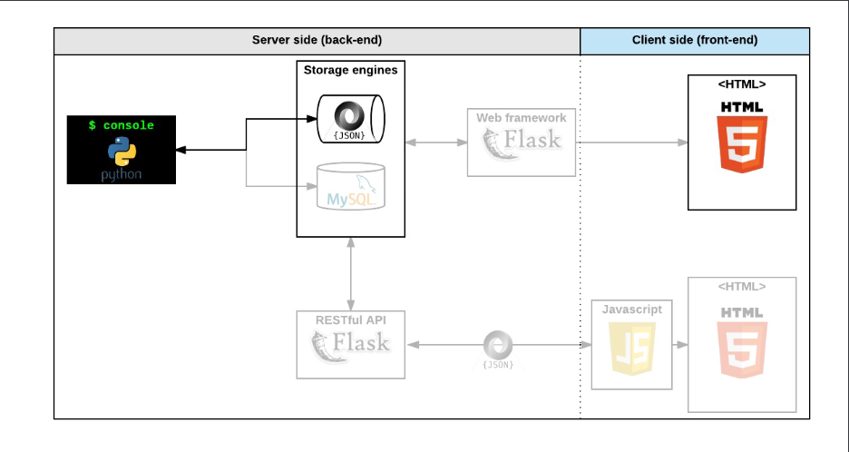

# AirBnB clone


> This is the first part of the **AirBnB Clone** Project. The goal of the entire project is to deploy on your server a simple copy of the AirBnB website. All the features will not be implemented, only some of them to cover all fundamental concepts of the higher level programming track. The entire application won't be built all at once, but step by step with different projects.

## Summary

The AirBnB clone project starts with this project; **The Console**. It is a command interpreter to manipulate data without a visual interface, like in a Shell (perfect for development and debugging), and then **Web static**; a website (the front-end) that shows the final product to everybody: static and dynamic.

## The Console



This phase involves;
- Creating your own **Data Model**
- **Managing objects** (create, update, destroy, etc) via a console / command interpreter
- **Store** and **Persist objects** to a file (JSON file)

The first piece is to manipulate a powerful storage system. This storage engine will give an abstraction between __*My object*__ and __*How they are stored and persisted*__.
> This means: from your console code (*the command interpreter itself*) and from the front-end and RestAPI you will build later, you won’t have to pay attention (take care) of how your objects are stored.

This abstraction will also allow you to change the type of storage easily without updating all of your codebase. [`FileStorage`](https://github.com/omar-ao/AirBnB_clone/blob/master/models/engine/file_storage.py)

The __*console*__ will be a tool to validate this storage engine.

> **Web static** will involve creating the **HTML** of your application and template of each object. (*HTML/CSS*)

### How does it work ?

When the backend starts, an instance of [`FileStorage`](https://github.com/omar-ao/AirBnB_clone/blob/master/models/engine/file_storage.py), named `storage`, is created by the command interpreter. This `storage` object is loaded or reloaded from class instances in the `file.json` (JSON file) (see [here](https://github.com/omar-ao/AirBnB_clone/blob/master/models/__init__.py)). As class instances undergo creation, updates, or deletion, the `storage` object __*records*__ these changes in the `file.json`.
> (via the save method of the [BaseModel](https://github.com/omar-ao/AirBnB_clone/blob/master/models/base_model.py) class).

### Using The Command Interpreter

The command interpreter, like a shell, can be activated, take in user input, and perform certain tasks to manipulate the object instances. Just like the Shell, the console works both in interactive mode and non-interactive modes.

To run the console in non-interactive mode, pipe any command(s) into an execution of the file `console.py` at the command line.
```sh
$ echo "help" | ./console.py
(hbnb) 
Documented commands (type help <topic>):
========================================
EOF  all  count  create  destroy  help  quit  show  update

(hbnb) 
```
To use the console in non interactive mode, run the file `console.py` by itself:
```sh
$ ./console.py
(hbnb) help

Documented commands (type help <topic>):
========================================
EOF  help  quit

(hbnb) 
(hbnb) 
(hbnb) quit
$
```
## Files

`#` | File/Folder | Description
--- | --- | ---
0x00 | [console.py](https://github.com/omar-ao/AirBnB_clone/blob/master/console.py) | The command interpreter to manage the AirBnB objects.
0x01 | [models](https://github.com/omar-ao/AirBnB_clone/tree/master/models) | The directory containing all the classes.
0x02 | [tests](https://github.com/omar-ao/AirBnB_clone/tree/master/tests) | The directory containig unittests for the classes and console.

### How to use

Enter interactive mode by running `./console.py` in your terminal to enter interactive mode.
```sh
$ ./console.py
(hbnb) help

Documented commands (type help <topic>):
========================================
EOF  help  quit

(hbnb) 
(hbnb) help quit
Quit command to exit the program

(hbnb) 
(hbnb) 
(hbnb) quit 
$ 
```
> These are the commands you can run in the console.

`#` | Command | Usage | Instance form | Description
--- | --- | --- | --- | ---
0x00 | quit | `quit` | nil | Exits the program
0x01 | EOF | `Ctrl + d` | nil | Exits the program
0x02 | empty line | ` ` | nil | do nothing
0x03 | create | `create <class name>` | nil | creates an instance of the class
0x04 | show | `show <class name> <id number>` | `<class name>.show(<id>)` | Prints the string representation of an instance based on the class name and id
0x05 | destroy | `destroy <class name> <id number>` | `<class name>.destroy(<id>)` | Deletes an instance based on the class name and id ( and saves the change into the `json.file`)
0x06 | all | `all` or `all <class name>` | `<class name>.all()` | Prints all string representation of all instances based or not on the class name
0x07 | update | `update <class name> <id number> <attribute to update> "<new value of attribute>"` | simple form:`<class name>.update(<id>, <attribute name>, <attribute value>)` update more than 1 attribute(using dictionaries): `<class name>.update(<id>, <dictionary representation>)` | Updates an instance based on the class name and id by adding or updating attribute (save the change into the `file.json`). If there are more commands, the command interpreter will only count the first attribute with its value
0x08 | count | `count <class name>` | `<class name>.count()` | retrieve the number of instances of a class

**Allowed Classes**:
- [BaseModel](https://github.com/omar-ao/AirBnB_clone/blob/master/models/base_model.py)
- [User](https://github.com/omar-ao/AirBnB_clone/blob/master/models/user.py)
- [Place](https://github.com/omar-ao/AirBnB_clone/blob/master/models/place.py)
- [State](https://github.com/omar-ao/AirBnB_clone/blob/master/models/state.py)
- [City](https://github.com/omar-ao/AirBnB_clone/blob/master/models/city.py)
- [Amenity](https://github.com/omar-ao/AirBnB_clone/blob/master/models/amenity.py)
- [Review](https://github.com/omar-ao/AirBnB_clone/blob/master/models/review.py)

> Usage illustrated below:

- help:
```sh
(hbnb) help

Documented commands (type help <topic>):
========================================
EOF  help  quit
```
- quit and EOF:
```sh
(hbnb) quit 
vagrant@ubuntu:~/AirBnB$ 
```
```sh
(hbnb) quit 
vagrant@ubuntu:~/AirBnB$ 
```
- create:
```sh
(hbnb) create BaseModel
2dd6ef5c-467c-4f82-9521-a772ea7d84e9
(hbnb) create User
35dd5991-c54f-4e33-a4c4-2be5219cc15e
```
- all:
```sh
(hbnb) all BaseModel
["[BaseModel] (49faff9a-6318-451f-87b6-910505c55907) {'created_at': datetime.datetime(2017, 10, 2, 3, 10, 25, 903293), 'id': '49faff9a-6318-451f-87b6-910505c55907', 'updated_at': datetime.datetime(2017, 10, 2, 3, 10, 25, 903300)}"]
```
- show:
```sh
(hbnb) show BaseModel 49faff9a-6318-451f-87b6-910505c55907
[BaseModel] (49faff9a-6318-451f-87b6-910505c55907) {'created_at': datetime.datetime(2017, 10, 2, 3, 10, 25, 903293), 'id': '49faff9a-6318-451f-87b6-910505c55907', 'updated_at': datetime.datetime(2017, 10, 2, 3, 10, 25, 903300)}
```
- destroy:
```sh
(hbnb) destroy
** class name missing **
```
- update:
```sh
(hbnb) show BaseModel 49faff9a-6318-451f-87b6-910505c55907
[BaseModel] (49faff9a-6318-451f-87b6-910505c55907) {'created_at': datetime.datetime(2017, 10, 2, 3, 10, 25, 903293), 'id': '49faff9a-6318-451f-87b6-910505c55907', 'updated_at': datetime.datetime(2017, 10, 2, 3, 10, 25, 903300)}
(hbnb) update BaseModel 49faff9a-6318-451f-87b6-910505c55907 first_name "Betty"
(hbnb) show BaseModel 49faff9a-6318-451f-87b6-910505c55907
[BaseModel] (49faff9a-6318-451f-87b6-910505c55907) {'first_name': 'Betty', 'id': '49faff9a-6318-451f-87b6-910505c55907', 'created_at': datetime.datetime(2017, 10, 2, 3, 10, 25, 903293), 'updated_at': datetime.datetime(2017, 10, 2, 3, 11, 3, 49401)}
```
- all or all BaseModel/User:
```sh
(hbnb) create User
35dd5991-c54f-4e33-a4c4-2be5219cc15e
(hbnb) create BaseModel
2c181221-b41f-47f9-bf2a-9e7bc53126a1
(hbnb) all BaseModel
["[BaseModel] (2c181221-b41f-47f9-bf2a-9e7bc53126a1) {'id': '2c181221-b41f-47f9-bf2a-9e7bc53126a1', 'created_at': datetime.datetime(2021, 7, 1, 4, 46, 34, 306736), 'updated_at': datetime.datetime(2021, 7, 1, 4, 46, 34, 306804)}", "[User] (35dd5991-c54f-4e33-a4c4-2be5219cc15e) {'id': '35dd5991-c54f-4e33-a4c4-2be5219cc15e', 'created_at': datetime.datetime(2021, 7, 1, 4, 46, 0, 151113), 'updated_at': datetime.datetime(2021, 7, 1, 4, 46, 0, 151209)}"]
(hbnb) all
["[BaseModel] (2c181221-b41f-47f9-bf2a-9e7bc53126a1) {'id': '2c181221-b41f-47f9-bf2a-9e7bc53126a1', 'created_at': datetime.datetime(2021, 7, 1, 4, 46, 34, 306736), 'updated_at': datetime.datetime(2021, 7, 1, 4, 46, 34, 306804)}", "[User] (35dd5991-c54f-4e33-a4c4-2be5219cc15e) {'id': '35dd5991-c54f-4e33-a4c4-2be5219cc15e', 'created_at': datetime.datetime(2021, 7, 1, 4, 46, 0, 151113), 'updated_at': datetime.datetime(2021, 7, 1, 4, 46, 0, 151209)}"]
(hbnb) all User
["[User] (35dd5991-c54f-4e33-a4c4-2be5219cc15e) {'id': '35dd5991-c54f-4e33-a4c4-2be5219cc15e', 'created_at': datetime.datetime(2021, 7, 1, 4, 46, 0, 151113), 'updated_at': datetime.datetime(2021, 7, 1, 4, 46, 0, 151209)}"]
(hbnb) 
```
- count:
```sh
(hbnb) all
["[BaseModel] (2c181221-b41f-47f9-bf2a-9e7bc53126a1) {'id': '2c181221-b41f-47f9-bf2a-9e7bc53126a1', 'created_at': datetime.datetime(2021, 7, 1, 4, 46, 34, 306736), 'updated_at': datetime.datetime(2021, 7, 1, 4, 46, 34, 306804)}", "[User] (35dd5991-c54f-4e33-a4c4-2be5219cc15e) {'id': '35dd5991-c54f-4e33-a4c4-2be5219cc15e', 'created_at': datetime.datetime(2021, 7, 1, 4, 46, 0, 151113), 'updated_at': datetime.datetime(2021, 7, 1, 4, 46, 0, 151209)}"]
(hbnb) count BaseModel
1
(hbnb) count User
1
```

## Environment & Requirements

- Language: Python3
- OS: Ubuntu 20.04 LTS
- Style guidelines: [PEP 8 (version 1.7)](https://www.python.org/dev/peps/pep-0008/)
- All your tests should be executed by using this command: `python3 -m unittest discover tests`

## Credits

Work is owned and maintained by [Omar Ahmed O](https://github.com/omar-ao) and [Ebube Ochemba](https://github.com/Ebube-Ochemba).

## Acknowledgement

All work contained in this project was completed as part of the curriculum for Alx. ALX is a leading technology training provider, built to accelerate the careers of young Africans through the technology and professional skills that enable them to thrive in the digital economy. The program prepares students for careers in the tech industry using project-based peer learning. For more information, [visit](https://www.alxafrica.com/).
